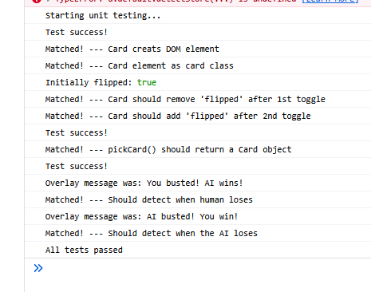

# Rough Plan

### Visual Testing
- Color scheme
- Shuffling animation
- Card covers
- Flip animations

### Unit Testing
- Write a test JS script

### Functional Testing
- Do the buttons on the screen work as intended on click?
  - Hit button
  - Play button
  - Stand button
  - Can you click things you shouldn't be able to?

# Documentation

### 1. Visual Testing
- Color scheme appears to be consistent ✅
<<<<<<< HEAD
- Shuffling animation ✅
=======
- Shuffling animation ...
>>>>>>> js-layout
- Is the card cover consistent (displays the team mascot)? ✅
- Flip animation:
  - Seems consistent ✅
  - No delay/lag ✅

<<<<<<< HEAD
### 2. Unit testing (see testing.js in testing/ folder for [full js code](testing.js))
  - CardConstructor (✅ Passed)
  - CardFlip (✅ Passed)
  - DeckInitialization (✅ Passed)
  - PickCardReducesDeck (✅ Passed)
  - UpdateCounter (✅ Passed)
  - Checkjoever (✅ Passed)
  

=======
### 2. Unit testing
>>>>>>> js-layout

### 3. Functional testing
- Possible problems with "play button" (see below)
- Waiting on other logic to be finished

## Possible errors/confusion:

#### Visual:
- No layout for the face of the card
- Shuffling animation seems to be a bit off?
  - (FIXED ✅ -- It was intentional)
- There seems to be no "You win" screen
<<<<<<< HEAD
  - (FIXED ✅)
=======

#### Unit testing:
>>>>>>> js-layout

#### Functional:
- On press "Play":
  - When dealing cards to the ai, once a card is dealt and flipped, the animation does not terminate, ultimately showing two cards when there's only only supposed to be one
  - Pressing "Play" does not remove "You busted" screen
<<<<<<< HEAD
    - (FIXED ✅)
=======
>>>>>>> js-layout
  - Animations that are already in motion do not cancel out, possibly carrying out parallel function calls
    - (FIXED ✅ buttons gray out once an animation is in motion)
  - Once the entire animations are over, and the cards have been dealt, an extra card seems to hover next to the deck
  - All variables/counter/cards/deck do not reset upon clicking "play"
    - (FIXED ✅ board is cleared and the logic is reset)
  
- On press "Hit" (logic not complete?)
  - Even at the start of the game, the user is allowed to press "hit" and would be dealt a single card (should not be the case)

- If a player has been busted, the game does not freeze buttons, allowing the user to still click around
<<<<<<< HEAD
=======
  - Win/Busted pop-up does not reset when "play" is pressed again
>>>>>>> js-layout

# Possible Additions

<<<<<<< HEAD
- Hide the "Play" button once it's been pressed
  - (ADDED ✅)
=======
>>>>>>> js-layout
- Hide the hit/stand buttons until "Play" is pressed
- Hide the hit/stand buttons when the player wins/loses
